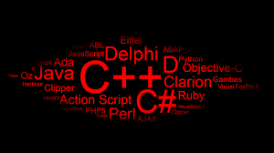

<p align="center">
<a href="https://github.com/shyam640">
 <p align='center'></p> 
</a>
 <p align='center'><i>"Creativity Arises from Relativity , if you can Relate Everything then you can create Anything."</i></p>
</p>

<h3>  Hi ! there, </h3> 

I'm Shyam, a CSE graduating 🎓 from <a href="https://www.lpu.in/">Lovely Professional University</a>. Primarily interested in Competitive Programming and Maths applied to reduce the Complexity of Program. 

You can see my github profile and all projects source code <a href="https://github.com/shyam640">here</a>.


<h3> 👨‍💻 Languages I use</h3>

<!--START_SECTION:colourise-->
<p align=center>
<!--  -->
<!--  -->


<!--  -->


</p>
<h3> 👨‍💻 Tools and Software I use</h3>
<p align="center">


</p>
<br><br>
<details>
<summary> <b>📊 Some GitHub stats </b></summary>
<p align="center">
  

</p>
</details>

<details>
<summary> <b>📊 Weekly Stats</b> </summary>

<!--START_SECTION:waka-->


**🐱 My Github Data** 

> 🏆  23 Contributions in the Year 2020
 > 
> 📦 Approx. 18.1 MB Used in Github's Storage 
 > 
> 💼 Opted to Hire
 > 
> 📜 21 Public Repositories
 > 
> 🔑 2 Private Repositories 

**I'm a Night 🦉** 

This an approximate calculation

```text
🌞 Morning    0 commits     ░░░░░░░░░░░░░░░░░░░░░   0% 
🌆 Daytime    2 commits     █░░░░░░░░░░░░░░░░░░░   20% 
🌃 Evening    0 commits     ░░░░░░░░░░░░░░░░░░░░░░   0% 
🌙 Night      7 commits     ██████████░░░░░░░░░░░░░░░  80%

```
📅 **I'm Most Productive on Sunday** 

```text
Monday       3 commits     ███░░░░░░░░░░░░░░░░░░░░░░   5% 
Tuesday      2 commits     ██░░░░░░░░░░░░░░░░░░░░░   4% 
Wednesday    1 commits     █░░░░░░░░░░░░░░░░░░░░░   3% 
Thursday     4 commits     ██████░░░░░░░░░░░░░░░░░░░   7% 
Friday       3 commits     ███░░░░░░░░░░░░░░░░░░░░░░░   5% 
Saturday     10 commits    █████████████░░░░░░░░░░░░░   30% 
Sunday       15 commits    ██████████████████░░░░░░░░   45%

```


📊 **This Week I Spent My Time On** 

```text
⌚︎ Time Zone: Mumbai/India

💬 Programming Languages: 
Python                   0 mins     
░░░░░░░░░░░░░░░░░░░░░░░░   0% 
C++                    3 hrs 54 mins       
████████████░░░░░░░░░░░░░   20% 
HTML/CSS                     25 mins            
████░░░░░░░░░░░░░░░░░░░   10% 
DSA                     6 hrs 20 mins              
████████████████████░░░░░   50%

🔥 Editors: 
VS-Code                     16 hrs 59 mins      
████████████████████░░░░░   75% 
Gitpod                      3 hrs 36 mins       
██████████░░░░░░░░░░░░░░░   20%
Online Editor               36 mins       
██░░░░░░░░░░░░░░░░░░░░░░░   5%


🐱‍💻 Projects: 
Webpage                 16 hrs 20 mins     
███████████████████░░░░░░   79.29% 
Snake Game             2 hrs 37 mins       
███░░░░░░░░░░░░░░░░░░░░░░   12.76% 
Extra                  1 hr 37 mins       
██░░░░░░░░░░░░░░░░░░░░░░░   7.9% 
Unknown                0 secs              
░░░░░░░░░░░░░░░░░░░░░░░░   0.05%

💻 Operating System: 
Windows                    13 hrs 36 mins     
█████████████████████████   80.0%
Linux                      16 hrs 20 mins     
███████████████████░░░░░░   20.0% 

```

**I Mostly Code in C++** 

```text
Python                   0 repos            
░░░░░░░░░░░░░░░░░░░░░░░░░   0% 
C++                      17 repos             
█████████████████████░░░░   65% 
C                        2 repos            
████████████░░░░░░░░░░░░░   15% 
Shell                    0 repos             
███████░░░░░░░░░░░░░░░░░░   10% 
HTML/CSS                  3 repos            
█████████████░░░░░░░░░░░░   10%

```
**My Interests**
```text
Coding                     90%
█████████████████████░░░
Poetry                     5%
███░░░░░░░░░░░░░░░░░░░░░
Extra Stuffs               5%
███░░░░░░░░░░░░░░░░░░░░░
```

</details>
 
<details>
<summary> <b>📫 Contact me </b></summary>
<p align="center">
<a href="https://www.linkedin.com/in/shyam-sundar-vashishtha-045871159/"></a>
<a href="https://www.instagram.com/its_shyam640/"></a>
<a href="mailto:shyamvashishtha640@gmail.com"></a>
</p>
</details>
<br><br>
<b> <i><=======CODING PLATFORMS==========></i>
<br><br>
<p> <a href="https://www.codechef.com/users/its_shyam640"></a>
<a href="https://www.hackerrank.com/its_shyam640"></a>
<a href="https://www.stopstalk.com/user/profile/its_shyam640"></a>
</p>

------

<p align="center">
  
    <a href="https://github.com/shyam640/"></a>
  <a href="https://github.com/shyam640/"></a>
</p>

-----
Credits: [Shyam Sundar Vashishtha](https://github.com/shyam640)
<br><br>
"Special Thanks to Github and its Community for guiding in making this Readme file."
