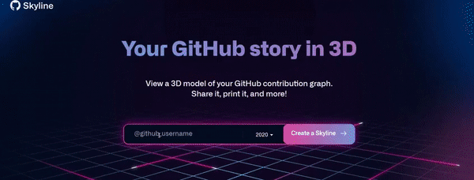

<p align="center">
<a href="https://github.com/shyam640">
 <p align='center'></p> 
</a>
 <p align='center'><i>"Creativity Arises from Relativity , if you can Relate Everything then you can create Anything."</i></p>
</p>
<br><br><br>


<h3>  Hi ! there, </h3> 

I'm Shyam, a CSE graduating 🎓 from <a href="https://www.lpu.in/">Lovely Professional University</a>. Primarily interested in Competitive Programming and Maths applied to reduce the Complexity of Program. 

[](https://git.io/typing-svg)

-----

<h3> 👨 About Me</h3>


-----
<h3> 👨‍💻 Languages,Frameworks and Databases I Know</h3>

<!--START_SECTION:colourise-->
<p align="center">
<!--  -->
<!--  -->


<!--  -->


 


</p>
<h3> 👨‍💻 Tools and Software I use</h3>
<p align="center">

 
  


</p>

<h3> 💻 Extra Tools</h3>
<p align="center">


</p>

-----

<br><br>
<details>
<summary> <b>📊 Some GitHub stats </b></summary>
<p align="center">

 <br><br>


 <br><br>

 <br><br>
 
</p>
</details>
<details>
<summary> <b>📊 Weekly Stats</b> </summary>

<!--START_SECTION:waka-->


**🐱 My Github Data (2020)** 

> 🏆  23 Contributions in the Year 2020
 > 
> 📦 Approx. 21.1 MB Used in Github's Storage 
 > 
> 💼 In Search of Job
 > 
> 📜 30 Public Repositories
 > 
> 🔑 2 Private Repositories 

**I'm a Night 🦉** 

This an approximate calculation

```text
🌞 Morning    7 commits     ████████████░░░░░░░░░░░  2% 
🌆 Daytime    3 commits     ██████░░░░░░░░░░░░░░░░░  15% 
🌃 Evening    5 commits     ███░░░░░░░░░░░░░░░░░░░░  3% 
🌙 Night      12 commits    █████████████████████░░  80%

```
📅 **I'm Most Productive on Sunday** 

```text
Monday       3 commits     ███░░░░░░░░░░░░░░░░░░░░   5% 
Tuesday      2 commits     ██░░░░░░░░░░░░░░░░░░░░░   4% 
Wednesday    1 commits     █░░░░░░░░░░░░░░░░░░░░░░   3% 
Thursday     4 commits     ██████░░░░░░░░░░░░░░░░░   7% 
Friday       3 commits     ███░░░░░░░░░░░░░░░░░░░░   5% 
Saturday     10 commits    █████████████░░░░░░░░░░   30% 
Sunday       15 commits    ██████████████████░░░░░   45%

```


📊 **This Week I Spent My Time On** 

```text
⌚︎ Time Zone: Gwalior/Madhya Pradesh/India

🔥 Editors: 
VS-Code                           
████████████████████░░░░░   65% 
Android Studio                 
████████████████████░░░░░   25% 
Gitpod                          
██████████░░░░░░░░░░░░░░░   7%
Online Editor                    
██░░░░░░░░░░░░░░░░░░░░░░░   3%


🐱‍💻 Learnings: 
Morning                   
████████████░░░░░░░░░░░░░   40% 
Day             
███░░░░░░░░░░░░░░░░░░░░░░   5% 
Night                    
████████████████░░░░░░░░░   55% 


💻 Operating System: 
Windows                    20 hrs     
█████████████████████████   80.0%
Linux                      4 hrs     
███████████████████░░░░░░   20.0% 

```


```
**My Interests**
```text
Coding                     90%
█████████████████████░░░
Extra Stuffs               10%
███░░░░░░░░░░░░░░░░░░░░░
```

</details>


<details>
<summary> <b>📫 Contact me </b></summary>
<p align="center">
<a href="https://www.linkedin.com/in/shyam-sundar-vashishtha-045871159/"></a>
<a href="https://www.instagram.com/its_shyam640/"></a>
<a href="mailto:shyamvashishtha640@gmail.com"></a>
</p>
</details>
<br><br>


<b> <i>CODING PLATFORMS</i>
<br><br>
<p> <a href="https://leetcode.com/its_shyam640/"></a>
 <a href="https://www.codechef.com/users/its_shyam640"></a>
<a href="https://www.hackerrank.com/its_shyam640"></a>
<a href="https://www.stopstalk.com/user/profile/its_shyam640"></a>
</p>

------

<p align="center">
  
 <a href="https://visitor-badge.glitch.me/badge?page_id=shyam640.visitor-badge"></a>
    <a href="https://github.com/shyam640/"></a>
  <a href="https://github.com/shyam640/"></a>
</p>

-----
Credits: [Shyam Sundar Vashishtha](https://github.com/shyam640)
<br><br>
"Special Thanks to Github and its Community for guiding in making this Readme file."
